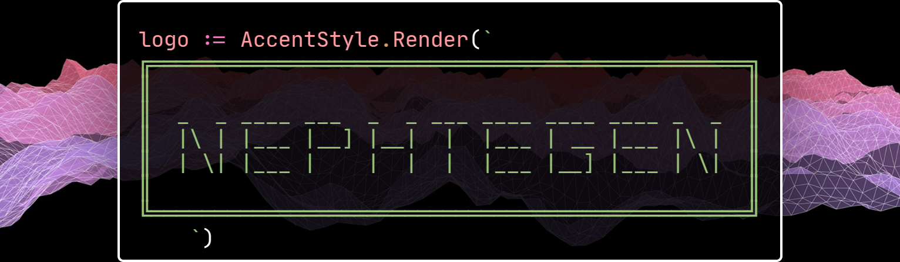
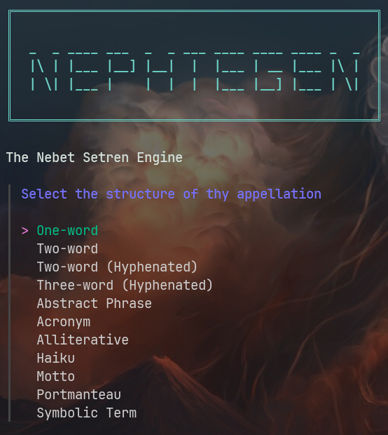

[](https://go.dev/)
[](LICENSE)
[](#)
[](https://github.com/bxavaby/nephtegen/issues)
[](https://github.com/bxavaby/nephtegen/network)
[](https://github.com/bxavaby/nephtegen/stargazers)

**Nephtegen** is a terminal-based creative assistant for conjuring names, phrases, haikus, acronyms, mottos, and more. Built in Go, powered by [Bubble Tea](https://github.com/charmbracelet/bubbletea) and [Fabric](https://github.com/danielmiessler/fabric), it blends procedural logic with poetic invention. It is ideal for naming systems, speculative fiction, or linguistic experimentation.

---

## ☍ Demo
  
⊹ *a walkthrough* ⊹

---

## ☍ Screenshots

 
⊹ *word formats* ⊹

 
⊹ *length rules* ⊹

 
⊹ *two-word example* ⊹

---

## ☍ Showcase (exemplar products)

### One-word
- **Cytos** ⇝ *can be defined as a network or system of cells, reflecting the intersection of biological (neolithic, in terms of ancient, primal connections) and technological (cyberpunk).* 
- **Tyomorph** ⇝ *can be defined as a powerful, isolated entity or device, possibly a weapon, that embodies the raw energy of the universe ("om") while warning of its tyrannical or overwhelming power ("ty").*

### Two-word
- **Oe Hexa** ⇝ *can be defined as a complex, symbolic system (Oe) that is used to cast or invoke a magical spell (Hexa), blending the concepts of semiotic entanglement and mystical ritual.*
- **Lunar Sting** ⇝ *can be defined as a mystical, arcane power that delivers a sharp, piercing blow, combining the celestial, magical connotations of "lunar" with the intense, wounding sensation of "sting".*

### Two-word (hyphenated)
- **Quake-Dream** ⇝ *can be defined as a magical, spell-like state that induces a surreal, dreamlike experience, marked by a descent into chaos and disorder, blending the destructive power of "quake" with the ethereal quality of "dream".*
- **Briar-Surf** ⇝ *can be defined as the skill or technique of navigating through the liminal, the threshold, or the transitional phases with ease and mastery, much like surfing through the challenges of the unknown.*

### Three-word (hyphenated)
- **Ixi-Mora-Thon** ⇝ *reflects a deep sense of uniqueness, blending emergent topology, spellbinding enchantment, and runic mysticism in a way that is both creative and profound.*
- **Jolt-Luna-Kai** ⇝ *reflects a genius in combining contrasting elements to create something both captivating and thought-provoking.*

### Abstract Phrase
- **Shattered Silence** ⇝ *embodies the absurdist essence by juxtaposing two paradoxical concepts: the destruction of quietude ("shattered") and the profound stillness of silence; this oxymoronic blend reflects the abyssal elegies theme, evoking a sense of depth and the unknowable; philosophically, it resonates with Camus's notion of confronting the abyss, where the search for meaning is juxtaposed with the absurd reality of existence; stylistically, the phrase aligns with the Vault and Obscurivenous styles by embracing the obscure and the mysterious, creating a sense of surreal and profound contemplation; the choice of "Sh" as the starting letter adds a sharp, abrupt quality, underscoring the violent interruption of silence, thus encapsulating the absurdist struggle to find elegance within the abyss.*
- **Psyche's Labyrinthine Shadows** ⇝ *delves into the macabre and stygian realms of ontological riddles, weaving a complex tapestry of meaning and absurdity; starting with "Ps", it plunges into the depths of the human psyche, where the labyrinthine paths symbolize the convoluted search for self and understanding; the inclusion of "Shadows" introduces an element of darkness and the unknown, echoing Kant's critique of metaphysics and the limits of human knowledge; this phrase embodies the absurdist quest for meaning in a seemingly meaningless world, where the self is lost in a maze of its own making; the macabre and stygian styles are reflected in the eerie, haunting quality of the phrase, while the ontological theme is explored through the existential implications of navigating one's own psyche; the result is a profoundly unsettling yet thought-provoking reflection on the human condition, inviting the reader to confront the shadows within.*

### Acronym
- **T.H.R.X.** - *Transmogrify, Hypnagogic, Rhizome, Xenogenesis*
- **R.E.A.X.O.N.** - *Relativity, Ether, Arcana, Xenon, Omniscience, Nexus*

### Alliterative Phrase
- **Xenial Xylophones Xerox** ⇝ *creates a unique sound pattern, blending the smooth, melodic quality of "Xenial" and "Xylophones" with the sharp, technological edge of "Xerox"; this juxtaposition embodies the Dieselpunk style, marrying organic and industrial elements, while the 'X' alliteration enhances the rhythm and flow, reflecting the Zen theme of embracing contradictions in a harmonious, innovative way.*
- **Hallowed Hilted Hierophants** ⇝ *masterfully weaves together Empyrean and Weaponry styles, as "Hallowed" evokes a sense of sacredness, "Hilted" references weaponry, and "Hierophants" implies mystical, cryptic knowledge; the 'H' alliteration creates a rhythmic flow, embodying the theme of Cryptic Whispers by suggesting ancient, mysterious guardians of hidden truths, innovatively blending the sacred and the martial within the specified length.*

### Haiku
☗  *Luminous depths rise* <br>  
*Fathomless passion unfurls* <br>  
*Liberty's dark flame*  
<br>
<br>
☗  *Zhivago's twilight* <br>  
*Gilded shadows softly* <br>  
*Midnight's velvet kiss*  

### Motto
- **Ätherkai no Kōhai, Kokū o Tsukamu.** ⇝ *weaves together elements of Japanese obscure folklore and technocratic themes to express the voidborne yearnings; "Ätherkai" combines "äther," suggesting an otherworldly or ethereal realm, with "kai," meaning sea or void, to evoke a sense of mysterious, cosmic expanses; "No Kōhai" translates to "of the descendants" or "of the successors," implying a lineage or legacy connected to the void; "Kokū o Tsukamu" means "to grasp the void" or "to seize the emptiness," reflecting a technocratic ambition to control, understand, or harness the power of the void.*
- **Gyakusatsu no Katabasis, Echoes of Elysium.** ⇝ *delves into the realms of Eidolonetic and Grotesque styles to unveil the Orphic Mysteries; "Gyakusatsu" is a term that suggests a violent or inverse descent, while "no Katabasis" translates to "of the downward journey," referencing the Orphic mythological theme of journeying into the underworld; "Echoes of Elysium" juxtaposes the bleakness of the descent with the promise of a paradise or haven (Elysium), hinting at the transformative power of facing the grotesque and the unknown; the Eidolonetic aspect is reflected in the exploration of the shadow self and the mystical, ethereal echoes that guide one through the darkest passages.*

### Portmanteau
- **Oeluxe** ⇝ *this portmanteau combines "Oe" with "luxe," seamlessly merging the sounds to create a phonetically appealing and elegant word; the components evoke a sense of high-end sophistication, with "luxe" conveying opulence and refinement, perfectly capturing the essence of decadent elegance.*
- **Hantech** ⇝ *this portmanteau fuses "Han" with "tech," blending the sounds to create a word that embodies the dark, futuristic essence of the underworld style; the components merge human ("Han") and technology ("tech"), symbolizing the posthuman ascension theme, where human evolution transcends into a technologically advanced state.*

### Symbolic Term
- **Yumei** ⇝ *this name is rooted in the Japanese language, where "yume" means dream; the term embodies the dreamlike theme by directly referencing the ethereal and often elusive nature of dreams; the addition of "i" at the end adds a touch of mysticism, suggesting a connection to the mysterious and the unknown; symbolically, "Yumei" invites the exploration of one's subconscious mind, delving into the surreal landscapes that dreams create; with its origins in Japanese etymology, "Yumei" aligns with the ossified style by presenting a name that is both ancient and timeless, evoking a sense of tradition and mystique.*
- **Yechim** ⇝ *this term is a fusion of concepts, reflecting the chimeric theme by combining disparate elements; the prefix "Ye" hints at a primal, archaic origin, while "chim" suggests a blending or merging, echoing the idea of chimeras as composite creatures; this name symbolizes the fusion of opposites or the amalgamation of different forms, embodying the essence of something that is greater than the sum of its parts; with its igniluminous style, "Yechim" shines with an inner light, illuminating the path to understanding the complex, multifaceted nature of chimeric entities; the etymology of "Yechim" is rooted in a blend of ancient linguistic elements, reflecting the chimeric theme of mixing and matching to create something anew.* <br>


## *Crafted by Nephtegen* <big>using Llama-3.3-70B-Versatile</big>

---

## ☍ Features

- **Interactive**: Responsive TUI flow built with Bubble Tea & Huh.
- **Pattern-Based Prompting**: Uses markdown templates per format type, stored in `patterns/`.
- **Alphabet Injection**: Injects rare letterforms to reduce LLM repetition.
- **Multiple Naming Forms**:
  - One-word, Two-word, Three-word
  - Haikus, Acronyms, Mottos
  - Portmanteaus, Symbolic Terms
  - Abstract or Alliterative Phrases
- **Logging**: Names and haikus are archived automatically.
- **Modular Expansion**: Easy to add new output types or templates.

---

## ☍ Getting Started

### Prerequisites
- **Go 1.21+**
- **Fabric** installed and accessible via CLI
- Ensure `fabric` command works in your shell (`zsh` or compatible)

### Installation
```bash
git clone https://github.com/bxavaby/nephtegen.git
cd nephtegen
go build -o neph
```

You can optionally move the binary for global use:
```bash
sudo mv neph /usr/local/bin/
```

Then run it:
```bash
neph
```

---

## ☍ Project Structure

```plaintext
.
├── assets/             # GIFs and screenshots
├── patterns/           # markdown-based prompt templates
│   ├── haiku/
│   ├── motto/
│   ├── one-word/
│   ├── two-word/
│   ├── ...
├── neph.go             # entry point
├── plex.go             # prompt flow logic and UI routing
├── gen.go              # generation logic for each format
├── tagen.go            # styling, spinners, progress, logo
├── letters.json        # letterforms for injection
├── LICENSE
└── README.md
```

---

## ☍ Patterns

Nephtegen does **not** load templates directly from the `patterns/` folder at runtime.

Instead, you must install them following [Fabric’s official pattern system](https://github.com/danielmiessler/fabric#custom-patterns). Each pattern must be placed inside the correct subdirectory of your local Fabric installation:

```bash
cp patterns/haiku/haikugen.md ~/.fabric/patterns/haiku/
```

---

## ☍ Technical Notes

By default, Nephtegen uses **Fabric’s `--session` flag** in its CLI prompts to group requests by output type (e.g., `haiku`, `motto`, `port`). This helps Fabric maintain contextual memory for iterative improvements — but depending on your **LLM backend**, this may result in:

- Slower response times
- Context length limitations
- Higher token usage or API throttling (especially when using OpenAI APIs)

If you experience performance issues or API rate errors, **you can safely remove the `--session` flags** in `gen.go`. Each generation function uses a helper like:
```go
callFabricX("haiku", "haikugen", prompt)
```

To disable session handling, simply swap it for:
```go
callFabric(prompt)
```

This invokes Fabric without persisting session memory. Output creativity may vary slightly, but performance will improve for API-based setups.

All examples above were generated using llama-3.3-70b-versatile (with Fabric, via Groq). While Nephtegen is model-agnostic, quality may vary across models.

---

## ☍ License
This project is licensed under the MIT License. See the LICENSE file for details.

